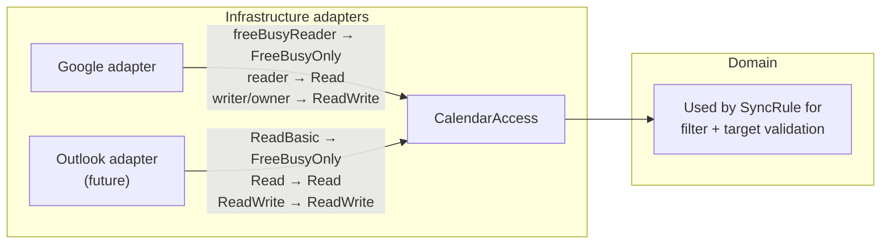

## Provider-agnostic Domain Modeling

**Status:** Proposed

**Deciders:** Team (Practice 4)

**[Initiative](Practice 4 — Modular Monolith Baseline)**

## Problem Statement

Calendar providers expose different permission models — Google uses `freeBusyReader`/`reader`/`writer`/`owner`, Microsoft Graph uses `Calendars.ReadBasic`/`Calendars.Read`/`Calendars.ReadWrite`. The Sync module needs to validate filters (source side) and confirm write access (target side) without referencing provider-specific types. We need a single provider-agnostic abstraction that covers both read capabilities and write permissions.

## Decision Drivers

- Domain layer must have zero dependencies on provider-specific types (Clean Architecture)
- Adding a new provider should require only a new infrastructure adapter — no domain or application changes
- The abstraction must express both read capability (for filter validation) and write permission (for target validation) in a unified model
- Provider permission levels are strictly ascending — no provider grants write without read

## Considered Options

### **Option A — Provider-specific enums in domain**

Use Google's `AccessRole` directly. Extend or add parallel enums per provider.

**Pros:** Simple, 1:1 API mapping

**Cons:** Google concepts pollute domain. Adding Outlook forces domain changes. Filter validation needs provider-specific branches — combinatorial growth.

### **Option B — Two separate fields (read capability + writable boolean)**

Separate read capability (`FreeBusyOnly`/`EventDetails`) from write permission (boolean flag).

**Pros:** Each field has clear single responsibility.

**Cons:** Two fields model what is actually one ascending axis — no provider grants write without full read. Redundant state space (`FreeBusyOnly` + `writable: true` is an impossible combination that the domain must reject). Two facade calls instead of one.

### **Option C — Unified CalendarAccess enum (3 levels)**

A single enum representing the ascending permission levels that exist across all providers:

- `FreeBusyOnly` — time blocks only, no event details, no write
- `Read` — full event details, no write
- `ReadWrite` — full event details, can create/modify/delete events

Each provider adapter maps its API-specific permissions to one of these three levels.

**Pros:** One field, one call, one validation path. Impossible states are unrepresentable. Maps cleanly to both Google and Outlook. Ascending order means comparisons are natural (`access >= Read` for keyword filters).

**Cons:** If a future provider has a level between `FreeBusyOnly` and `Read` (e.g., titles but not descriptions), the enum must be extended.

### **Option D — Fine-grained capability flags**

A VO with booleans: `CanReadTitles`, `CanReadDescriptions`, `CanWrite`, etc.

**Pros:** Maximum flexibility for any permission combination.

**Cons:** Overengineered — only three meaningful levels exist today. Scattered flag checks instead of a clean switch. YAGNI.

## Decision

We decided for **Option C — Unified `CalendarAccess` enum** because provider permissions are a single ascending axis, and three levels cover Google and Outlook without redundant state.

### Adapter mapping

### How domain rules use CalendarAccess

| Rule | Condition |
|---|---|
| Keyword filters allowed | source access >= `Read` |
| Copy title from source allowed | source access >= `Read` |
| Target can receive blocked events | target access = `ReadWrite` |

### Expected Benefits

- Single enum, single facade call, single validation path
- Impossible states unrepresentable (no "writable but can't read details")
- Outlook adapter requires zero domain changes
- Ascending order enables clean comparisons in domain rules

### Accepted Downsides

- If a future provider has a permission level between `FreeBusyOnly` and `Read` (e.g., titles but not descriptions), the enum must be extended. Acceptable — one-point change.
- Adapter authors make a judgment call when mapping. Mitigated by documenting the mapping in each adapter.

---

**Previous version:** n/a — initial architecture decision
