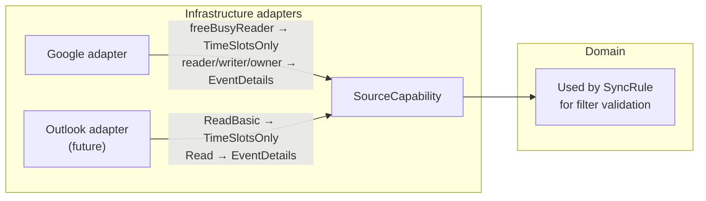

## Provider-agnostic Domain Modeling

**Status:** Proposed

**Deciders:** Team (Practice 4)

**[Initiative](Practice 4 — Modular Monolith Baseline)**

## Problem Statement

Calendar providers expose different permission models — Google uses `freeBusyReader`/`reader`/`writer`/`owner`, Microsoft Graph uses `Calendars.ReadBasic`/`Calendars.Read`. The Sync module's filter validation depends on what data is available from the source calendar. If provider-specific concepts leak into the domain, adding a new provider forces changes across both modules. We need a provider-agnostic way to express source calendar capabilities.

## Decision Drivers

- Domain layer must have zero dependencies on provider-specific types (Clean Architecture)
- Adding a new provider should require only a new infrastructure adapter — no domain or application changes
- The abstraction must be expressive enough for the Sync module to validate filters and visibility modes

## Considered Options

### **Option A — Provider-specific enums in domain**

Use Google's `AccessRole` directly. Extend or add parallel enums per provider.

**Pros:** Simple, 1:1 API mapping

**Cons:** Google concepts pollute domain. Adding Outlook forces domain changes. Filter validation needs provider-specific branches — combinatorial growth.

### **Option B — Provider-agnostic capability enum**

Define `SourceCapability` in the domain with two levels:
- `TimeSlotsOnly` — only start/end times (Google `freeBusyReader`, Outlook `ReadBasic`)
- `EventDetails` — titles, descriptions, attendees (Google `reader`+, Outlook `Read`)

Each provider adapter maps its API-specific permission to `SourceCapability`.

**Pros:** Domain is provider-agnostic. Single validation code path. Adding Outlook = one adapter, zero domain changes.

**Cons:** May not capture future edge cases (e.g., titles-only without descriptions). Translation is a judgment call in the adapter.

### **Option C — Fine-grained capability flags**

A `SourceCapabilities` VO with booleans: `CanReadTitles`, `CanReadDescriptions`, `CanReadAttendees`, etc.

**Pros:** Maximum flexibility for any permission combination.

**Cons:** Overengineered — only two meaningful levels exist today. Scattered flag checks instead of a clean switch. YAGNI.

## Decision

We decided for **Option B — Provider-agnostic capability enum** because two levels cover Google and Outlook, and extending the enum later is a single-point change far cheaper than provider-specific branching.

### Adapter mapping

### Expected Benefits

- Single filter validation path regardless of provider count
- Outlet adapter requires zero domain changes
- Self-documenting — developers understand the constraint without knowing any provider's API

### Accepted Downsides

- If a future provider has a permission level between the two (e.g., titles but not descriptions), the enum must be extended. Acceptable — one-point change.
- Adapter authors make a judgment call when mapping. Mitigated by documenting the mapping in each adapter.

---

**Previous version:** n/a — initial architecture decision
