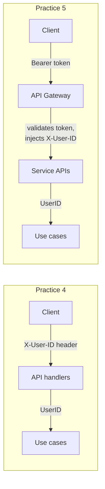

## Authentication Strategy and Calendar OAuth

**Status:** Proposed

**Deciders:** Team (Practice 4)

**[Initiative](Practice 4 — Modular Monolith Baseline)**

## Problem Statement

CalendarSync needs two distinct identity concepts: (1) knowing *who the user is* (authentication) and (2) *accessing their calendars* on external providers (calendar OAuth). These are often conflated — "log in with Google" and "connect your Google Calendar" look similar but have different lifecycles. A user might revoke calendar access without logging out, or connect multiple Google accounts under one login. We need to decide how to handle both concerns across practices 4–8 without overbuilding now.

## Decision Drivers

- Practice 4 has no first-party UI, but we still need a browser-based Google consent flow initiated by the API
- Both modules need a `UserID` to scope data ownership, but neither needs user profile data (name, email, avatar)
- Calendar OAuth tokens are sensitive secrets with rotation and expiry logic — they belong in the Connections module
- Authentication will evolve: fake in Practice 4, API Gateway in Practice 5, possibly JWT in later practices
- The solution must not couple calendar connectivity to user authentication — they have different lifecycles
- Infrastructure is not tied to GCP — Google Cloud project is only needed for Calendar API credentials, deployment can be anywhere (AWS, local, etc.)

## Considered Options

### **Option A — User entity + Identity module**

Create a third module (`Identity`) with a `User` aggregate. Handle authentication and user management as a first-class bounded context. Both Connections and Sync reference `UserID` from the Identity module.

**Pros:**
- Standard approach for production systems
- Clear ownership of auth concerns

**Cons:**
- `User` entity would have near-zero domain logic in Practice 4 — no registration, no profile, no password, no sessions
- Third module in a 1-week practice violates "start simple" guidance
- ADR-001 already decided on two modules; adding a third contradicts that decision

### **Option B — Shared UserID value object, no user entity**

Define `UserID` as a typed UUID in the `shared/` package. Both modules store it as an owner field on their aggregates. No user entity, no identity module. Authentication is handled externally to the domain:

- Practice 4: `X-User-ID` request header (API layer extracts it, no validation)
- Practice 5: API Gateway validates tokens, injects trusted `X-User-ID` header
- Later: JWT middleware, session management — all in API/gateway layer, never in domain

**Pros:**
- Zero overhead — no entity, no module, no migration for something with no domain logic
- Both modules are testable with any UserID — no auth dependency in tests
- Authentication strategy can evolve without touching domain code
- Matches the reality: neither module cares *who* the user is, only that data is scoped by owner

**Cons:**
- No user-level invariants (e.g., "free tier users limited to 3 sync rules") — these would need to live in the Sync module or be added later
- `X-User-ID` header in Practice 4 is trivially fakeable — acceptable for a non-production exercise

### **Option C — Embed user management in Connections module**

Since the Connections module already handles OAuth with Google, extend it to also own user identity — "connecting Google" creates both the user session and the calendar connection.

**Pros:**
- Single OAuth flow for both auth and calendar access

**Cons:**
- Conflates two lifecycles: revoking calendar access would log the user out
- Connecting a second Google account becomes an identity crisis — which one is "the user"?
- Makes Connections module responsible for too many concerns — violates single responsibility

## Decision

We decided for **Option B — Shared UserID, no user entity** because neither module has domain logic that depends on user attributes. Authentication is a cross-cutting infrastructure concern that belongs in the API/gateway layer, not in the domain.

For Practice 4, the API exposes an auth URL endpoint and an OAuth completion endpoint. The user opens Google's consent screen in a browser, authorizes one Google account, and sends the returned authorization code back to the API. The Google Cloud project is only needed to register OAuth client credentials (client ID + secret).

To support multiple Google accounts per app user, the Connections module identifies external accounts by the Google OpenID Connect `sub` claim from the validated `id_token`, not by provider name or email. Email is stored as descriptive display data only.

### Authentication evolution path

### Credential storage strategy

Only the `refresh_token` is persisted — encrypted at rest using AES-256-GCM with a key from the `ENCRYPTION_KEY` environment variable. The `access_token` is short-lived (~1 hour) and regenerated on demand from the refresh token when the infrastructure layer needs to call the Google API. This minimizes the attack surface: a database leak exposes encrypted refresh tokens, not usable access tokens.

Encryption/decryption is a repository concern in `connections/infrastructure/`, not a domain concern. The `OAuthCredential` value object in the domain holds the decrypted refresh token in memory — it never sees ciphertext.

The `id_token` is not persisted. It is validated during OAuth completion using Google's token validation library and used only to extract the stable provider account ID (`sub`) and email for the connected account.

### Expected Benefits

- Zero boilerplate for a concept with no domain logic
- Authentication strategy evolves in the API layer only — domain code is stable across practices
- Calendar OAuth is cleanly owned by Connections module, decoupled from user identity
- Browser-assisted OAuth flow works without a first-party UI, with real Google tokens and real API calls
- One app user can connect multiple Google accounts, and reconnect maps to the correct existing account via provider account identity

### Accepted Downsides

- No user-level business rules (plan limits, usage quotas) until a `User` entity is introduced. Acceptable — no such rules exist in Practice 4 scope.
- `X-User-ID` header is unsecured in Practice 4. Acceptable — this is a development exercise, not production. API Gateway in Practice 5 adds real validation.

---

**Previous version:** n/a — initial architecture decision
