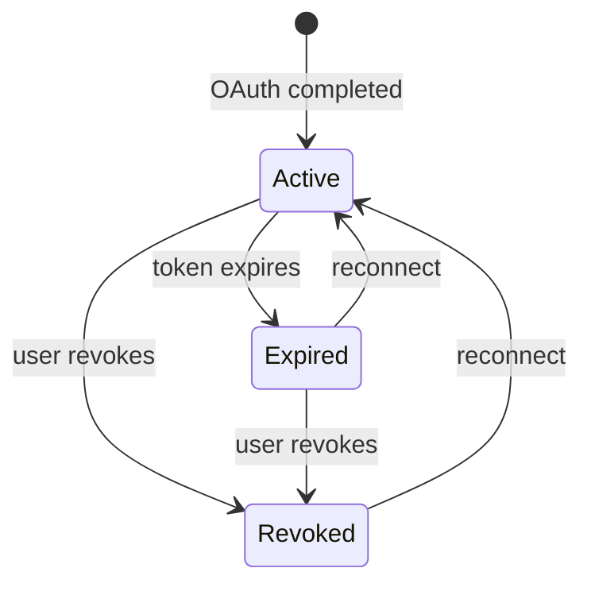
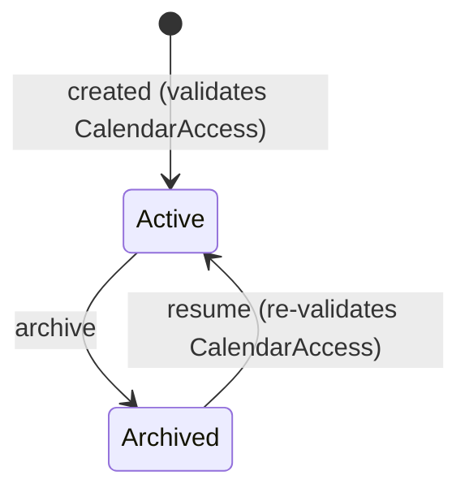

## Aggregate design and domain rules

**Status:** Proposed

**Deciders:** Team (Practice 4)

**[Initiative](Practice 4 — Modular Monolith Baseline)**

## Problem Statement

Practice 4 requires at least 3 domain rules per module, enforced inside the domain model — not in controllers or infrastructure. We need to define each module's aggregate root, its value objects, the invariants it protects, and valid state transitions. Without explicit rules, domain logic risks leaking into handlers or being forgotten entirely.

## Decision Drivers

- Aggregates must be the sole entry point for mutations — all state changes go through named methods
- Domain rules must be enforceable without database or external service access (pure domain logic)
- Value objects must be immutable and self-validating on construction
- Status transitions must be explicit — no arbitrary state jumps
- Cross-module interaction (Sync calls Connections facade for `CalendarAccess`, see ADR-002) must be reflected in the aggregate API

### [Entity Relationship Diagram](../diagrams/entity-relationship.mmd)

## CalendarAccount aggregate

### Status machine



### Domain rules

| # | Rule | Enforced by |
|---|------|-------------|
| C1 | Token expiry drives status — if `OAuthCredential.ExpiresAt` is past and status is `Active`, transition to `Expired` | `CheckExpiry()` on any read/mutation |
| C2 | Reconnecting the same provider account replaces stored credentials and returns the account to `Active` from `Active`, `Expired`, or `Revoked` | `Reconnect(newCredential)` |
| C3 | `Revoke()` is idempotency-protected — an already revoked account cannot be revoked again | `Revoke()` |
| C4 | Calendar list refresh requires `Active` status | `RefreshCalendars(calendars)` |
| C5 | Each connected provider account has a stable provider-scoped identity (`ProviderAccountId`) and descriptive email captured at OAuth completion | `Create()`, `Reconstitute()` |
| C6 | Max connections per user per provider (e.g., 5) | Application layer (needs repo query) |

### Value objects

- **OAuthCredential** — refreshToken non-empty, tokenExpiresAt tracks when the last access token expired (used by rule C1 to drive status). Only the refresh token is persisted (encrypted at rest, see ADR-003); access tokens are ephemeral and regenerated on demand by the infrastructure layer. Immutable; refresh produces a new instance.
- **CalendarInfo** — providerCalendarID non-empty, valid `CalendarAccess` (see ADR-002). Immutable. Persisted in `calendars` table with its own uuid PK.
- **Provider** — enum: `Google`, `Outlook` (future).

### Identity note

`CalendarAccount` represents one external provider account, not one calendar. For Google, identity is the validated OpenID Connect `sub` claim returned in `id_token`. A single `CalendarAccount` may own many calendars, and reconnecting one Google account must not affect the user's other connected Google accounts.

### Facade contract

```csharp
public interface IConnectionService
{
    Task<CalendarAccess> GetCalendarAccessAsync(Guid calendarId, CancellationToken ct = default);
    Task<IReadOnlyList<CalendarInfo>> ListCalendarsAsync(Guid accountId, CancellationToken ct = default);
    Task<string> GetFreshAccessTokenAsync(Guid calendarId, CancellationToken ct = default);
}
```

## SyncRule aggregate

### Status machine



### Domain rules

| # | Rule | Enforced by |
|---|------|-------------|
| S1 | Source and target must reference different calendars | `NewSyncRule()` constructor |
| S2 | Source `FreeBusyOnly` → keywords must be empty | `NewSyncRule(srcAccess, tgtAccess)`, `Resume(srcAccess, tgtAccess)`, `UpdateFilter(filter, srcAccess)` |
| S3 | Source `FreeBusyOnly` → `copyTitle` must be false (nothing to copy) | `NewSyncRule(srcAccess, tgtAccess)`, `Resume(srcAccess, tgtAccess)`, `UpdateTitle(copyTitle, customTitle, srcAccess)` |
| S4 | TimeWindow: `startHour` < `endHour`, weekdays non-empty | `FilterPolicy` VO constructor |
| S5 | Status transitions: `Active ↔ Archived` only | `Archive()`, `Resume(srcAccess, tgtAccess)` |
| S6 | Creation requires `CalendarAccess` for both source and target — rule starts `Active` immediately | `NewSyncRule(srcAccess, tgtAccess)` |
| S7 | Target must have `ReadWrite` access | `NewSyncRule(srcAccess, tgtAccess)`, `Resume(srcAccess, tgtAccess)` |
| S8 | Resume re-validates access — connections may have changed while archived | `Resume(srcAccess, tgtAccess)` |
| S9 | `customTitle` must be non-empty | `NewSyncRule()`, `UpdateTitle()` |
| S10 | Filter/title changes require source `CalendarAccess` parameter | `UpdateFilter(filter, srcAccess)`, `UpdateTitle(copyTitle, customTitle, srcAccess)` |
| S11 | Archiving clears `lastSyncToken` — next resume triggers full re-sync | `Archive()` |

### Value objects

- **FilterPolicy** — stored as JSONB. Contains `excludes` (string array: `"all_day"`, `"declined"`, extensible), `timeWindow` (optional: startHour, endHour, weekdays), `keywords` (optional string array). Self-validates TimeWindow (rule S4) and keyword count cap (e.g., 20). Cross-validation against `CalendarAccess` (rules S2, S3) is the aggregate's job. Adding a new filter type = new C# field/property + JSON key, zero migrations.
- **TimeWindow** — startHour (0–23), endHour (0–23), weekdays (non-empty []int). Self-validates S4. Embedded within FilterPolicy.

### Persistence strategy (hybrid)

Stable fields (`copy_title`, `custom_title`, `status`, `last_sync_token`) are stored as columns with DB-level constraints. The volatile filter configuration is stored as a single `filter_policy jsonb` column. Rationale: filter types will grow (new excludes, new dimensions), and each new filter should require only a C# model change — not a migration. Title config is two stable fields with no expected growth, so columns give us DB constraints and schema visibility.

## Decision

Both aggregates enforce invariants through constructor validation and guarded mutation methods. No public setters — all changes go through named methods that check preconditions. Value objects are immutable and self-validating. Status machines are explicit with no backdoors.

`CalendarAccess` is not persisted on `SyncRule` — the Connections module is always the source of truth. The aggregate receives it as a parameter during mutations that depend on it.

### Expected Benefits

- Domain rules are testable with pure unit tests — no database, HTTP, or mocks needed
- Status machines prevent invalid state transitions at runtime
- Cross-module capability check is explicit in the aggregate API — not hidden in infrastructure
- Adding rules is additive — new invariants are new method guards, not scattered across handlers

### Accepted Downsides

- Reading a `SyncRule` from the database doesn't reveal what access level it was validated against. Acceptable — access is always checked live from Connections.
- C6 (max connections per provider) lives in the application layer because it requires a repo query. Documented to avoid confusion about aggregate boundary.

---

**Previous version:** n/a — initial architecture decision
