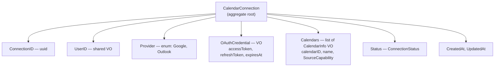
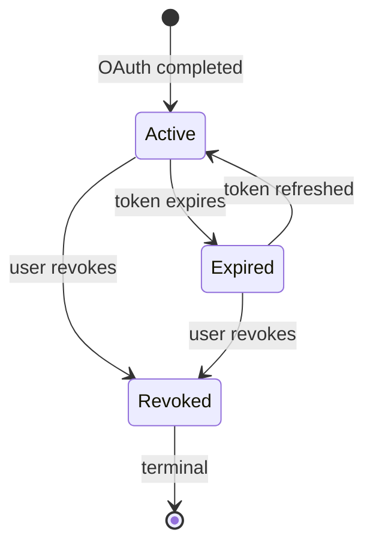
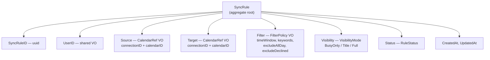
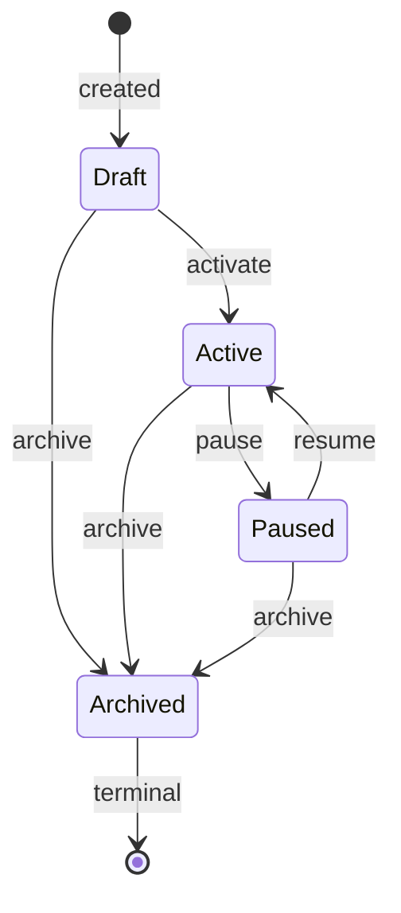
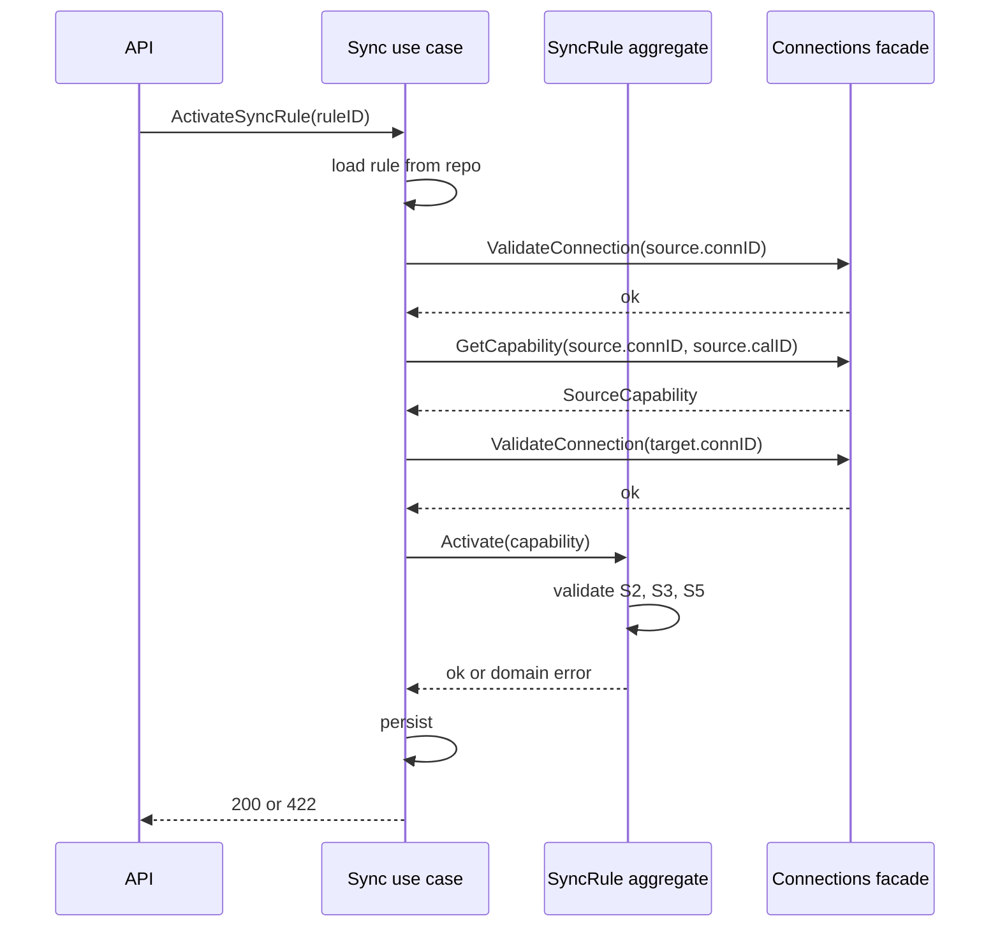

## Aggregate Design and Domain Rules

**Status:** Proposed

**Deciders:** Team (Practice 4)

**[Initiative](Practice 4 — Modular Monolith Baseline)**

## Problem Statement

Practice 4 requires at least 3 domain rules per module, enforced inside the domain model — not in controllers or infrastructure. We need to define each module's aggregate root, its value objects, the invariants it protects, and valid state transitions. Without explicit rules, domain logic risks leaking into handlers or being forgotten entirely.

## Decision Drivers

- Aggregates must be the sole entry point for mutations — all state changes go through named methods
- Domain rules must be enforceable without database or external service access (pure domain logic)
- Value objects must be immutable and self-validating on construction
- Status transitions must be explicit — no arbitrary state jumps
- Cross-module interaction (Sync calls Connections facade for `SourceCapability`, see ADR-002) must be reflected in the aggregate API

## Connections module — CalendarConnection aggregate

### Structure



### Status machine



### Domain rules

| # | Rule | Enforced by |
|---|------|-------------|
| C1 | Token expiry drives status — if `OAuthCredential.ExpiresAt` is past and status is `Active`, transition to `Expired` | `CheckExpiry()` on any read/mutation |
| C2 | `Revoked` is terminal — cannot transition to `Active` or `Expired` | `Revoke()`, all transition methods |
| C3 | Credential refresh requires `Active` or `Expired` status | `RefreshCredential(newToken)` |
| C4 | Calendar list refresh requires `Active` status | `RefreshCalendars(calendars)` |
| C5 | Max connections per user per provider (e.g., 5) | Application layer (needs repo query) |

### Value objects

- **OAuthCredential** — accessToken non-empty, expiresAt in the future at creation. Immutable; refresh produces a new instance.
- **CalendarInfo** — calendarID non-empty, valid `SourceCapability` (see ADR-002). Immutable.
- **Provider** — enum: `Google`, `Outlook` (future).

### Facade contract

```go
type ConnectionService interface {
    GetCapability(ctx, connectionID, calendarID) (SourceCapability, error)
    ValidateConnection(ctx, connectionID) error
    ListCalendars(ctx, connectionID) ([]CalendarInfo, error)
}
```

## Sync module — SyncRule aggregate

### Structure



### Status machine



### Domain rules

| # | Rule | Enforced by |
|---|------|-------------|
| S1 | Source and target must reference different calendars | `NewSyncRule()` constructor |
| S2 | `TimeSlotsOnly` capability → keywords must be empty | `Activate(cap)`, `UpdateFilter(filter, cap)` |
| S3 | `TimeSlotsOnly` capability → visibility must be `BusyOnly` | `Activate(cap)`, `UpdateVisibility(vis, cap)` |
| S4 | TimeWindow: `startHour` < `endHour`, weekdays non-empty | `FilterPolicy` VO constructor |
| S5 | Status transitions follow the state machine only | All transition methods |
| S6 | Activation requires `SourceCapability` parameter — aggregate re-validates S2 + S3 | `Activate(cap)` |
| S7 | Filter/visibility changes require `SourceCapability` parameter — re-validates S2 + S3 | `UpdateFilter(filter, cap)`, `UpdateVisibility(vis, cap)` |

### Value objects

- **CalendarRef** — connectionID (uuid) + calendarID (string), both non-empty. Does *not* store `SourceCapability` — capability is fetched live from Connections facade to avoid staleness.
- **FilterPolicy** — self-validates TimeWindow (rule S4), keyword count cap (e.g., 20). Cross-validation against capability is the aggregate's job, not the VO's.
- **VisibilityMode** — enum: `BusyOnly`, `Title`, `Full`.
- **TimeWindow** — startHour (0–23), endHour (0–23), weekdays (non-empty). Self-validates S4.

## Cross-module interaction

`SyncRule` methods that validate against capability (`Activate`, `UpdateFilter`, `UpdateVisibility`) accept `SourceCapability` as a parameter. The application layer is responsible for obtaining it from the Connections facade before calling the aggregate:



## Decision

Both aggregates enforce invariants through constructor validation and guarded mutation methods. No public setters — all changes go through named methods that check preconditions. Value objects are immutable and self-validating. Status machines are explicit with no backdoors.

`SourceCapability` is not persisted on `SyncRule` — the Connections module is always the source of truth. The aggregate receives it as a parameter during mutations that depend on it.

### Expected Benefits

- Domain rules are testable with pure unit tests — no database, HTTP, or mocks needed
- Status machines prevent invalid state transitions at runtime
- Cross-module capability check is explicit in the aggregate API — not hidden in infrastructure
- Adding rules is additive — new invariants are new method guards, not scattered across handlers

### Accepted Downsides

- Reading a `SyncRule` from the database doesn't reveal what capability it was validated against. Acceptable — capability is always checked live from Connections.
- C5 (max connections per provider) lives in the application layer because it requires a repo query. Documented to avoid confusion about aggregate boundary.

---

**Previous version:** n/a — initial architecture decision
