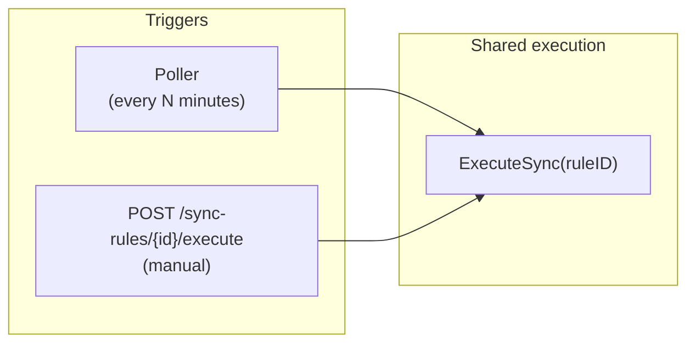
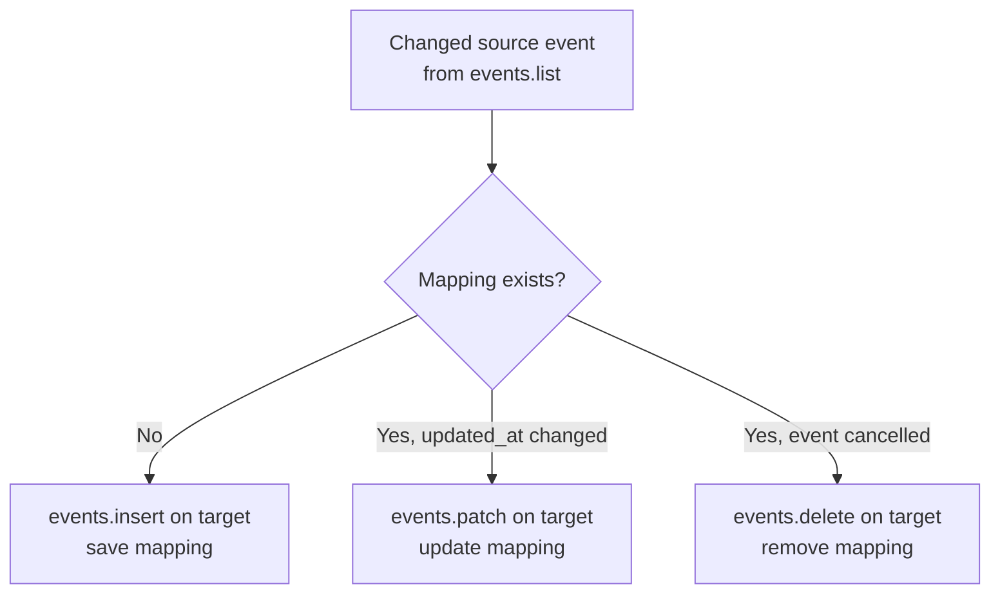

## Sync Execution Strategy

**Status:** Proposed

**Deciders:** Team (Practice 4)

**[Initiative](Practice 4 — Modular Monolith Baseline)**

## Problem Statement

CalendarSync needs to detect changes on source calendars and reflect them as blocked events on target calendars. We need to decide how sync is triggered, how changes are detected efficiently, and how source-to-target event relationships are tracked — all within Practice 4 scope (single binary, no message broker, no distributed workers).

## Decision Drivers

- Must work behind NAT/firewall with no publicly reachable endpoint
- Must handle event creates, updates, and deletions on the source calendar
- Must not create duplicate blocks on the target
- Must recover gracefully from failures (server restart, API errors)
- Must not require a new domain entity — `SyncRule` is the only aggregate in the Sync module for Practice 4
- Should prepare for async execution in Practice 6 (RabbitMQ) without major refactoring

## Considered Options

### **Option A — Google push notifications (webhooks)**

Register a webhook via `events.watch()`. Google sends a POST to our callback URL when events change on a watched calendar. Near-real-time updates.

**Pros:**
- Minimal latency — changes detected within seconds
- No wasted API calls polling unchanged calendars

**Cons:**
- Requires a publicly reachable HTTPS endpoint — not available behind NAT, university networks, or local Docker
- Webhook channels expire after 7 days and need renewal machinery
- Google sends a notification *that* something changed, not *what* changed — still need `events.list` with syncCursor to get the delta
- Practice 4 scope doesn't justify the infrastructure complexity (TLS certs, webhook verification, channel renewal)

### **Option B — Polling on interval**

A background goroutine iterates over all active `SyncRule` records on a timer (e.g., every 5 minutes), fetching changes from source calendars and applying them to targets.

**Pros:**
- Works anywhere — no public endpoint, no TLS, no webhook registration
- Simple to implement — one goroutine, one ticker, one loop
- Failure recovery is automatic — if a cycle fails, the next one retries
- Combined with Google's `syncToken`, polling is efficient — only changed events are returned

**Cons:**
- Latency up to one poll interval (configurable, default 5 minutes)
- Scales linearly with active rule count — each rule is one API call per cycle

### **Option C — Polling + manual trigger API**

Same as Option B, plus a `POST /sync-rules/{id}/execute` endpoint that runs the sync for one rule on demand. The poller and manual trigger share the same execution logic.

**Pros:**
- All benefits of Option B
- Manual trigger enables testing, debugging, and immediate sync after rule creation
- The shared execution path means one code path to test and maintain
- In Practice 6, the manual trigger becomes "publish a sync request to RabbitMQ" — same API, different backend

**Cons:**
- Same latency caveat as Option B for automatic sync
- Manual trigger adds one endpoint — marginal complexity

## Decision

We decided for **Option C — Polling + manual trigger** because it covers both automatic background sync and on-demand execution with a single shared code path, works in any environment, and the manual trigger becomes the natural async entry point in Practice 6.

### Trigger flow

### Change detection: CalendarSyncer Port

Each provider has a different mechanism for detecting changes (Google uses syncToken, Outlook uses deltaLink, Apple uses ctag + etag diffing). The sync execution use case must not know which mechanism is in use.

The cursor is an opaque string stored on `SyncRule.syncCursor`. Each provider adapter interprets it:
- **Google adapter:** passes it as syncToken to events.list(), receives new token in response
- **Outlook adapter:** passes it as deltaLink to the delta endpoint
- **Apple adapter:** uses it as ctag, does etag diffing internally, returns the new ctag

1. First sync (no token): `events.list(calendarId, timeMin=now-30d)` — returns all events + a `syncToken`
2. Subsequent syncs: `events.list(calendarId, syncToken=X)` — returns only events changed since last call + a new `syncToken`
3. Token expired: Google returns `410 Gone` — clear token and mappings, do a full re-sync

### Event mapping: synced_events table

The sync execution needs to know, for each source event, whether a corresponding block already exists on the target and what its ID is. This is tracked in a `synced_events` mapping table — an infrastructure concern, not a domain entity:

| Column | Type | Purpose |
|---|---|---|
| id | uuid PK | Row identity |
| sync_rule_id | uuid FK | Which rule owns this mapping |
| source_event_id | varchar | Provider event ID on source calendar |
| target_block_id | varchar | Created block event ID on target calendar |
| source_updated_at | timestamp | Last known update time of source event |

Unique constraint: `(sync_rule_id, source_event_id)` — one mapping per source event per rule.

This table enables three operations without extra API calls:

### Alternatives to the mapping table

We considered storing the source event ID in the target block's `extendedProperties.private` field (Google supports custom key-value pairs on events). This eliminates the mapping table but requires an API call per source event to check for existing blocks — too slow for rules with hundreds of events.

### Archiving behavior

When a rule is archived (S11), `syncCursor` is cleared. The `synced_events` mappings are preserved. On resume, a full re-sync runs (no token), but existing mappings prevent duplicate block creation — the execution sees "mapping exists, event unchanged → skip" rather than "no mapping → insert duplicate."

When Google returns `410 Gone`, both `syncCursor` and all `synced_events` for that rule are cleared. This is a hard reset — the source state is too stale to trust any mapping.

### Evolution path

| Practice | Change |
|---|---|
| P4 (now) | Poller goroutine + manual trigger, in-process |
| P5 | Sync module extracted as service; poller stays with Sync (owns the data it iterates) |
| P6 | Manual trigger publishes to RabbitMQ; poller publishes rule IDs to queue; consumers run ExecuteSync |
| P7 | ExecuteSync becomes a Saga with persisted `SyncJob` state for observability |

The `ExecuteSync(ruleID)` function signature stays the same across all practices. Only the trigger mechanism changes.

### Expected Benefits

- One code path for both automatic and manual sync — easy to test and debug
- Incremental sync via provider-specific cursors minimizes API calls (typically 1 call per rule per cycle)
- CalendarSyncer port means adding a provider is one adapter file — no use case or domain changes
- Mapping table enables O(1) lookup for create/update/delete decisions — no extra API calls
- Works in any network environment — no public endpoint required
- Clean migration path to async execution in Practice 6

### Accepted Downsides

- Sync latency up to one poll interval (default 5 minutes). Acceptable — calendar availability doesn't need sub-second updates.
- Poller scales linearly with active rules. For Practice 4 scope (tens of rules, not thousands), this is fine. In Practice 6, the poller becomes a message producer and consumers handle parallelism.
- `synced_events` table grows with event count. Mitigated by deleting mappings when source events are cancelled or rules are hard-deleted.

---

**Previous version:** n/a — initial architecture decision
